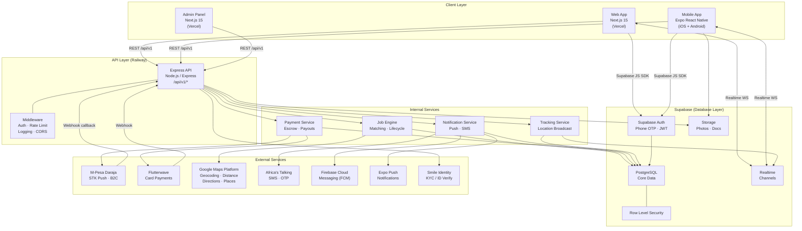
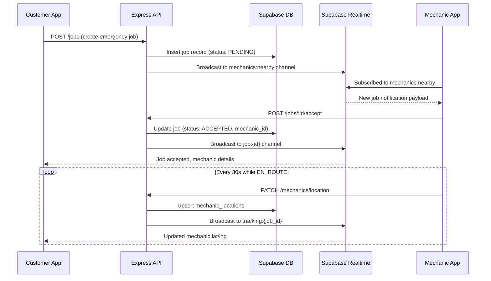
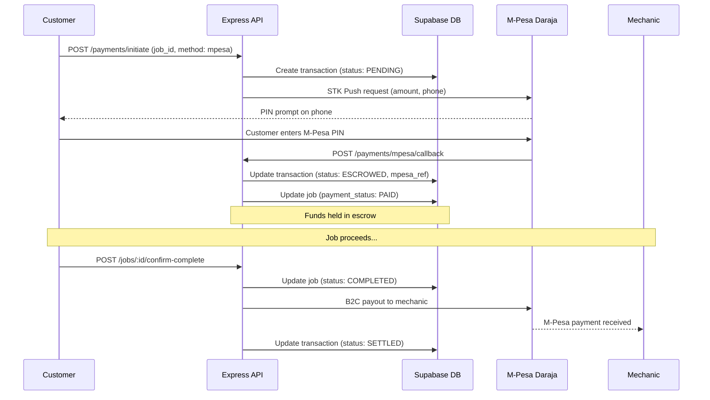

# Sparkflow — Architecture Diagram
**Version:** 1.0 | **Phase:** Preparation

---

## System Architecture



---

## Real-Time Communication Pattern



---

## Payment Flow



---

## Service-to-Service Data Flow

```
┌─────────────────────────────────────────────────────────────────┐
│                      REQUEST LIFECYCLE                          │
├─────────────────────────────────────────────────────────────────┤
│                                                                  │
│  Client Request                                                  │
│       │                                                          │
│       ▼                                                          │
│  [Express Middleware]                                            │
│  ├─ JWT Verification (Supabase public key)                       │
│  ├─ Role extraction from JWT claims                              │
│  ├─ Rate limiting (redis-like via Supabase or Upstash)           │
│  └─ Request logging                                              │
│       │                                                          │
│       ▼                                                          │
│  [Route Handler]                                                 │
│  ├─ Input validation (Zod schemas)                               │
│  ├─ Business logic                                               │
│  └─ Service calls (Job Engine, Payment Svc, etc.)                │
│       │                                                          │
│       ▼                                                          │
│  [Supabase Client (service role)]                                │
│  ├─ DB read/write (bypasses RLS for backend ops)                 │
│  ├─ Realtime broadcasts                                          │
│  └─ Storage operations                                           │
│       │                                                          │
│       ▼                                                          │
│  Response → Client                                               │
│                                                                  │
└─────────────────────────────────────────────────────────────────┘
```

---

## Infrastructure Map

```
┌─────────────────────────────────────────────────────┐
│  PRODUCTION INFRASTRUCTURE                           │
│                                                      │
│  ┌──────────────┐    ┌──────────────┐               │
│  │  Vercel       │    │  Railway      │               │
│  │  - Web App    │    │  - Express API│               │
│  │  - Admin      │    │  - Env vars   │               │
│  │  - Edge CDN   │    │  - Auto-scale │               │
│  └──────────────┘    └──────────────┘               │
│                                                      │
│  ┌──────────────────────────────────────┐           │
│  │  Supabase Cloud                       │           │
│  │  - PostgreSQL (primary + read replica)│           │
│  │  - Auth server                        │           │
│  │  - Realtime server                    │           │
│  │  - Storage (S3-compatible)            │           │
│  │  - Edge Functions (webhooks, crons)   │           │
│  └──────────────────────────────────────┘           │
│                                                      │
│  ┌──────────────┐    ┌──────────────┐               │
│  │  GitHub       │    │  Sentry       │               │
│  │  Actions CI   │    │  Error Track  │               │
│  │  - Test       │    │  - API        │               │
│  │  - Build      │    │  - Web        │               │
│  │  - Deploy     │    │  - Mobile     │               │
│  └──────────────┘    └──────────────┘               │
│                                                      │
└─────────────────────────────────────────────────────┘
```
